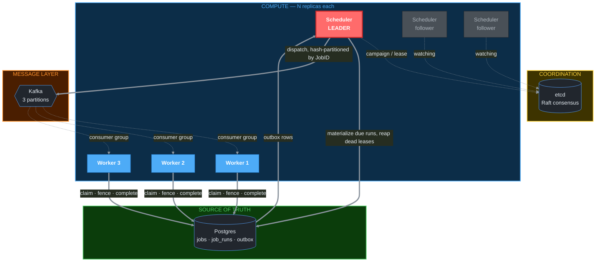
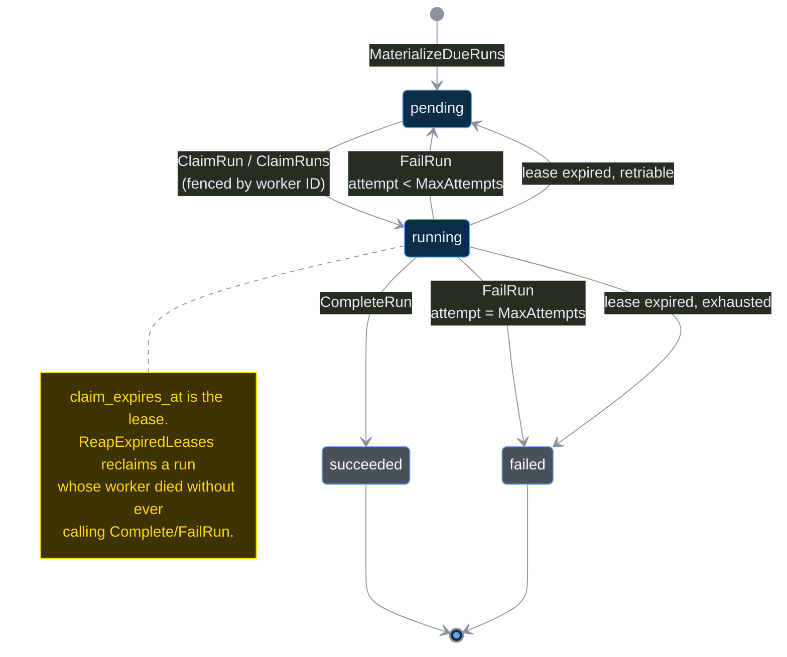
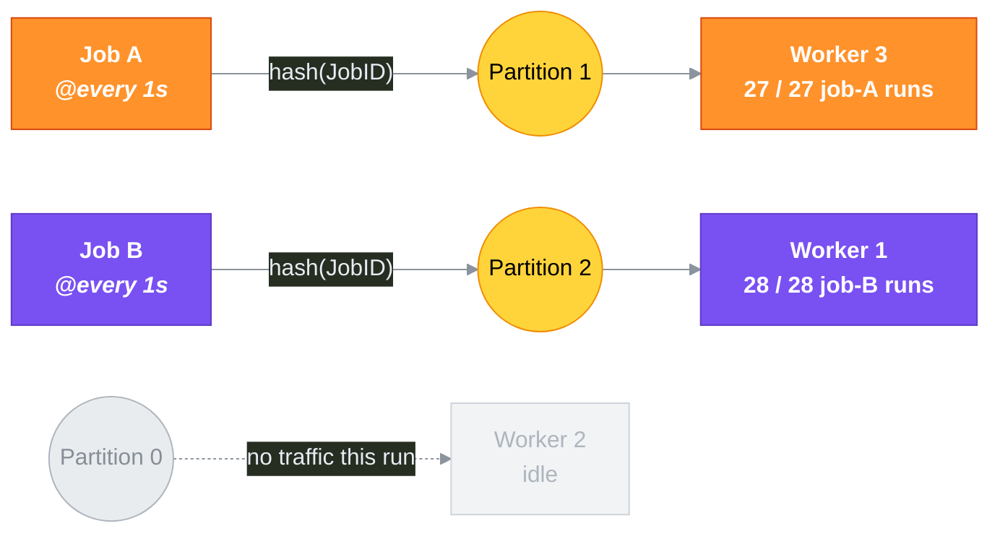

# orbit

A distributed job scheduler — the same class of problem Kubernetes' CronJob controller, Temporal, and Airflow solve — built from scratch in Go to demonstrate the mechanics most portfolio projects wave their hands at: leader election, exactly-the-right-amount-of-execution under crashes, safe concurrent claiming with zero external coordination, and message-queue migration done correctly.

No AI, no CRUD, no web frontend. This is a systems project, and it's built to be defended in an interview, not just demoed.

## What it actually does

Define a job with a schedule (`@every 30s`) and a payload. `orbit` fires it on time, retries it if it fails, never fires it twice for the same instant, survives a crashed scheduler or a crashed worker without losing or duplicating work, spreads execution across as many workers as you run, and keeps one tenant's traffic from starving another's — all coordinated through Postgres, etcd, Kafka, and Redis, with no single point of manual intervention.

## Architecture



Only the scheduler drawn in red is actually doing anything at any given moment — the others are idle followers, watching etcd, ready to take over.

## How a job runs, end to end

```mermaid
%%{init: {'theme':'base', 'themeVariables': {
  'background': '#0d1117',
  'primaryColor': '#21262d',
  'primaryTextColor': '#e6edf3',
  'primaryBorderColor': '#58a6ff',
  'lineColor': '#8b949e',
  'textColor': '#e6edf3',
  'actorBkg': '#21262d',
  'actorBorder': '#58a6ff',
  'actorTextColor': '#e6edf3',
  'actorLineColor': '#8b949e',
  'signalColor': '#8b949e',
  'signalTextColor': '#e6edf3',
  'labelBoxBkgColor': '#21262d',
  'labelBoxBorderColor': '#58a6ff',
  'labelTextColor': '#e6edf3',
  'loopTextColor': '#e6edf3',
  'noteBkgColor': '#3d3300',
  'noteTextColor': '#ffd60a',
  'noteBorderColor': '#ffd60a',
  'activationBkgColor': '#30363d',
  'activationBorderColor': '#58a6ff',
  'sequenceNumberColor': '#0d1117'
}}}%%
sequenceDiagram
    autonumber
    participant J as jobs
    participant S as Scheduler
    participant O as outbox
    participant K as Kafka
    participant W as Worker
    participant R as job_runs

    rect rgb(13, 45, 74)
    Note over S,J: every poll_interval — only on the LEADER
    S->>J: SELECT due jobs FOR UPDATE SKIP LOCKED
    S->>R: INSERT (job_id, scheduled_for) ON CONFLICT DO NOTHING
    S->>O: INSERT outbox row
    S->>J: UPDATE next_run_at
    Note right of O: all four writes are ONE Postgres transaction
    end

    rect rgb(74, 58, 10)
    S->>O: SELECT undispatched FOR UPDATE OF o SKIP LOCKED
    S->>K: publish(run_id) — key = job_id, so it's always the same partition
    S->>O: UPDATE dispatched_at = now()
    end

    rect rgb(15, 64, 35)
    K-->>W: deliver (this worker owns the partition)
    W->>R: UPDATE status='running' WHERE status='pending'
    alt claimed successfully
        W->>W: execute(payload)
        alt succeeded
            W->>R: UPDATE status='succeeded'
        else failed, attempts remain
            W->>R: UPDATE status='pending', attempt += 1
            W->>O: INSERT outbox row — retry needs dispatching too
        else failed, attempts exhausted
            W->>R: UPDATE status='failed'
        end
    else already claimed — duplicate delivery
        Note over W: harmless no-op, thanks to fencing
    end
    W->>K: commit offset
    end
```



Blue = materialize, yellow = dispatch, green = claim-execute-report. Each zone is its own atomic step; nothing here needs a distributed transaction spanning Postgres and Kafka, because the outbox row is what makes the handoff between them safe.

## Run lifecycle



## System design concepts, and where they actually live

Every one of these is implemented and covered by a test that proves the property, not just a comment asserting it.

| Concept | Where | What it actually proves |
|---|---|---|
| **Idempotent, exactly-once-enough execution** | `migrations/0001_init.up.sql` (`UNIQUE (job_id, scheduled_for)`) | The database, not application code, refuses a duplicate firing |
| **Safe concurrent claiming, zero coordination** | `internal/store/runs.go` (`ClaimRuns`, `SELECT ... FOR UPDATE SKIP LOCKED`) | 5 concurrent goroutines race for 1 row; exactly 1 wins, proven under `-race` |
| **Fencing** | `internal/store/runs.go` (`CompleteRun`, `FailRun`) | A worker whose lease expired can't overwrite a result that isn't its to write — proven in `TestCompleteRunFencing` |
| **Misfire collapsing** | `internal/job/schedule.go` (`Schedule.FastForward`) | A scheduler down for an hour fires once on restart, not 120 times |
| **Leader election** | `internal/election` (etcd session/campaign/resign) | Only one scheduler replica does work; graceful failover is sub-second, crash failover is bounded by the election TTL — both measured live |
| **Transactional outbox** | `migrations/0002_outbox.up.sql`, `store.DispatchOutbox` | Solves the dual-write problem: a Postgres commit and a Kafka publish aren't atomic, so the outbox row is |
| **Consistent hashing** | `internal/hashring` | Adding a 6th node to a 5-node ring remaps ~16% of keys (measured), not the ~83% a naive `hash % N` would |
| **Partition-aware message routing** | `internal/queue/balancer.go` (`HashBalancer`) | A job's runs consistently land on the same Kafka partition (and, in steady state, the same worker) — verified live: 27/27 job-A firings via Kafka went to one worker, 28/28 job-B firings went to a different one, zero mixing. The single exception (1 job-A run landing on job-B's worker) came from the reconciliation sweep, which bypasses Kafka and therefore partition affinity entirely — expected, not a bug |
| **Reconciliation as a safety net, not a religion** | `cmd/worker` (`sweepLoop`) | If the outbox/Kafka path is ever down, the original batch-poll claim path still finds the work |
| **Per-tenant rate limiting without spending retries** | `internal/ratelimit` (Lua-scripted token bucket in Redis), `cmd/worker` (`handleRunID`) | An `EVAL`-atomic token bucket, checked before `ClaimRun` -- proven not to over-admit under concurrency in `TestAllowNoOverAdmitConcurrent`, the same "race for one slot" proof shape as `TestClaimRunsNoDoubleClaim`. A throttled run is deferred to `sweepLoop`, not routed through `FailRun`, so backpressure never spends one of the run's real `MaxAttempts` |

## Proven under real failure, not just designed for it

Every diagram above is the intended design. These two are what actually happened when the design was pushed against real infrastructure.

**Leader failover — graceful vs. crash, side by side:**

```mermaid
%%{init: {'theme':'base', 'themeVariables': {
  'background': '#0d1117',
  'primaryColor': '#21262d',
  'primaryTextColor': '#e6edf3',
  'primaryBorderColor': '#58a6ff',
  'lineColor': '#8b949e',
  'textColor': '#e6edf3',
  'actorBkg': '#21262d',
  'actorBorder': '#58a6ff',
  'actorTextColor': '#e6edf3',
  'actorLineColor': '#8b949e',
  'signalColor': '#8b949e',
  'signalTextColor': '#e6edf3',
  'labelBoxBkgColor': '#21262d',
  'labelBoxBorderColor': '#58a6ff',
  'labelTextColor': '#e6edf3',
  'loopTextColor': '#e6edf3',
  'noteBkgColor': '#3d3300',
  'noteTextColor': '#ffd60a',
  'noteBorderColor': '#ffd60a',
  'activationBkgColor': '#30363d',
  'activationBorderColor': '#58a6ff',
  'sequenceNumberColor': '#0d1117'
}}}%%
sequenceDiagram
    participant A as Scheduler A
    participant E as etcd
    participant B as Scheduler B

    A->>E: Campaign()
    E-->>A: elected leader
    B->>E: Campaign() — blocks, waiting

    rect rgb(15, 64, 35)
    Note over A,B: Graceful shutdown — SIGTERM
    A->>E: Resign()
    E-->>B: elected leader
    Note over A,B: same second in the logs
    end

    rect rgb(74, 20, 20)
    Note over A,B: Crash — SIGKILL, no Resign()
    A--xE: keepalives stop
    Note over E: lease expires after ORBIT_ELECTION_TTL (3s in the demo)
    E-->>B: elected leader
    Note over A,B: ~3.7s later — measured
    end
```



A clean shutdown hands off in under a second because `Resign()` actively releases the election key. A hard crash costs the full TTL, because that's the only way etcd can tell the difference between "dead" and "just slow" — there's no free lunch, only a dial you get to choose.

**Consistent hashing, holding up under a live 2-job, 3-worker run:**



Zero mixing across dozens of firings — every job-A run went to worker 3, every job-B run went to worker 1. Worker 2 sitting idle isn't a bug: with only 2 distinct job keys spread across 3 partitions, one partition getting no traffic is exactly what you'd expect. With real job/tenant cardinality this evens out on its own.

## Getting started

Requires Docker and Go 1.26+.

```bash
# 1. Start Postgres, etcd, Kafka, and Redis
docker compose -f deploy/compose/docker-compose.yml up -d

# 2. Apply the schema
docker exec -i compose-postgres-1 psql -U scheduler -d scheduler < migrations/0001_init.up.sql
docker exec -i compose-postgres-1 psql -U scheduler -d scheduler < migrations/0002_outbox.up.sql

# 3. Seed a job (there's no API yet -- see Roadmap)
docker exec -i compose-postgres-1 psql -U scheduler -d scheduler -c \
  "INSERT INTO jobs (tenant_id, name, schedule, payload, enabled, max_attempts, next_run_at) \
   VALUES ('demo', 'hello', '@every 10s', '{\"message\":\"hello from orbit\"}', true, 3, now());"

# 4. Run the scheduler and one or more workers, in separate terminals
go run ./cmd/scheduler
go run ./cmd/worker
```

Run a second `go run ./cmd/worker` in another terminal and watch work split across both. Run a second `go run ./cmd/scheduler` and only one will log "elected leader" — kill it and watch the other take over.

## Terminal dashboard

```bash
go run ./cmd/tui
```

A single-screen, read-only view of live scheduler state — the `k9s`/`lazydocker`-style alternative to querying Postgres by hand while watching a demo run. It polls `internal/store` every 2s (`tea.Tick`, no manual refresh) and shows:

- **Jobs** — id, tenant, name, schedule, enabled, and next run time (rendered relative to now, e.g. `in 5s` / `12s ago` — an overdue job is a sign the scheduler is falling behind).
- **Run status counts** — pending/running/succeeded/failed, scoped to the most recent 500 runs by ID (`internal/store/dashboard.go`'s `RunStatusCounts`), not a time window — see that file's doc comment for why: an `ORDER BY id DESC LIMIT n` scan costs the same whether `job_runs` has a thousand rows or a hundred million, where a `created_at`-based window would have to scan every older row to rule it out.

`q` or `ctrl+c` quits. Like the other two binaries, it's configured entirely by `ORBIT_*` environment variables (`ORBIT_DATABASE_URL`, defaulting to `store.DefaultDevDSN` like everything else) — no flags, no config file, and it never writes to the database: no job creation or run cancellation from here, on purpose, the same "don't build it before there's a real need" restraint behind deferring a pluggable executor.

### Configuration

All three binaries are configured entirely by environment variables (no config file, no flags) — the standard pattern for anything meant to run in a container.

**`cmd/scheduler`**

| Variable | Default | Meaning |
|---|---|---|
| `ORBIT_NODE_ID` | `<hostname>-<pid>` | Identity used in leader election |
| `ORBIT_DATABASE_URL` | local dev Postgres | Postgres connection string |
| `ORBIT_POLL_INTERVAL` | `5s` | How often the leader ticks (materialize, reap, dispatch) |
| `ORBIT_BATCH_SIZE` | `50` | Max rows processed per tick |
| `ORBIT_ETCD_ENDPOINTS` | `localhost:2379` | Comma-separated etcd endpoints |
| `ORBIT_ELECTION_KEY` | `/orbit/scheduler-leader/` | etcd key the leader election runs on |
| `ORBIT_ELECTION_TTL` | `10s` | Leader session TTL — the failover-speed/flapping-sensitivity tradeoff |
| `ORBIT_KAFKA_BROKERS` | `localhost:19092` | Comma-separated Kafka brokers |
| `ORBIT_KAFKA_PARTITIONS` | `3` | Partition count for topic creation |

**`cmd/worker`**

| Variable | Default | Meaning |
|---|---|---|
| `ORBIT_WORKER_ID` | `<hostname>-<pid>` | Identity used for lease claims |
| `ORBIT_DATABASE_URL` | local dev Postgres | Postgres connection string |
| `ORBIT_LEASE` | `30s` | How long a claimed run is held before it's considered abandoned |
| `ORBIT_SWEEP_INTERVAL` | `30s` | How often the reconciliation sweep runs |
| `ORBIT_BATCH_SIZE` | `10` | Max rows the sweep claims per pass |
| `ORBIT_KAFKA_BROKERS` | `localhost:19092` | Comma-separated Kafka brokers |
| `ORBIT_KAFKA_GROUP` | `orbit-workers` | Consumer group — all workers should share this |
| `ORBIT_REDIS_ADDR` | `localhost:6380` | Redis address backing the per-tenant rate limiter |
| `ORBIT_RATE_LIMIT_PER_TENANT` | `10` | Token bucket capacity and refill rate, in requests/sec, applied uniformly to every tenant |

**`cmd/tui`**

| Variable | Default | Meaning |
|---|---|---|
| `ORBIT_DATABASE_URL` | local dev Postgres | Postgres connection string |
| `ORBIT_TUI_REFRESH_INTERVAL` | `2s` | How often the dashboard polls the store |
| `ORBIT_TUI_JOB_LIMIT` | `50` | Max jobs shown in the table |
| `ORBIT_TUI_RUN_WINDOW` | `500` | How many of the most recent runs the status counts are scoped to |

## Project structure

```
cmd/
  scheduler/     leader-elected loop: materialize due runs, reap dead leases, dispatch to Kafka
  worker/        claims + executes runs, via Kafka (primary) and a periodic sweep (safety net)
  tui/           bubbletea dashboard: read-only, live job/run-status view (internal/store/dashboard.go)
internal/
  job/           pure domain logic (Schedule, Job, Run) -- no database, no infra, fully unit-tested
  store/         the only package that knows Postgres exists
  election/      the only package that knows etcd exists
  queue/         the only package that knows Kafka exists
  hashring/      consistent hashing, standalone and fully tested on its own
  ratelimit/     the only package that knows Redis exists
migrations/      versioned SQL, golang-migrate-compatible naming
deploy/compose/  local dev infrastructure (Postgres, etcd, Kafka, Redis)
```

Every `internal/` package is a hard boundary, not a convention: the Go compiler itself blocks any package outside this module from importing it. Each infra dependency (Postgres, etcd, Kafka, Redis) is contained to exactly one package that owns it; nothing else in the codebase imports a driver directly.

## Design decisions worth knowing before an interview asks about them

- **`SKIP LOCKED` isn't what prevents duplicate runs.** The `UNIQUE (job_id, scheduled_for)` constraint does that, on its own, even with zero other locking. What `SKIP LOCKED` prevents is a subtler bug: two schedulers racing to advance the same job's `next_run_at` and one silently undoing the other's progress.
- **Leader election is about efficiency, not safety.** The system is already correct with multiple scheduler replicas running unelected — `SKIP LOCKED` alone prevents duplicate work. Election exists so N replicas don't all redundantly hammer Postgres with the same query every tick, and so there's one unambiguous owner instead of a free-for-all.
- **"Exactly once" is never claimed anywhere in this codebase.** The real guarantee is at-least-once delivery with idempotent, fenced execution — which composes to "effectively once" in practice. Claiming true exactly-once is the kind of overstatement a good interviewer will immediately probe.
- **The outbox pattern exists because a DB commit and a Kafka publish aren't atomic.** Publishing inside the transaction risks a phantom message for a row that gets rolled back; publishing after commit risks a crash silently losing the dispatch. The outbox row, written atomically with the state change, is what closes that gap — at the cost of being only ever "at least once," which is exactly why the fencing above has to exist regardless of whether Kafka is involved.
- **Consistent hashing and Kafka consumer groups solve different problems.** Kafka's group coordinator already rebalances partitions across live workers on its own. The hash ring's job is narrower: giving a job's runs a *stable* partition over time (and minimal disruption if the topic is ever repartitioned) — not replacing worker-level load balancing, which Kafka already does.

## Known limitations

Stated explicitly rather than glossed over:

- **No API yet** — jobs are inserted directly via SQL. A `cmd/api` service is the natural next step.
- **`cmd/worker` has a per-run N+1 query** (`GetJob` after every claim, to fetch the payload) — fine at current batch sizes, a known candidate for folding into the claim query itself if it ever becomes a hot path.
- **No pluggable executor** — `cmd/worker/execute.go` is a single function, not an `Executor` interface with a registry, because there's exactly one kind of job so far. Building the abstraction before a second kind exists would be solving a problem this system doesn't have yet.
- **Rate limiting is global-shape, not per-tenant configurable** — `ORBIT_RATE_LIMIT_PER_TENANT` sets one requests/sec ceiling applied uniformly to every tenant's own bucket. A database-backed, per-tenant-configurable limit is the natural next step once real tenant traffic makes that a genuine need, not before.
- **A rate-limited run waits for the sweep, not instant redelivery** — `cmd/worker` never routes a throttled run through `FailRun` (that would spend a real retry attempt on pure backpressure), so it stays `pending` and is only retried on `sweepLoop`'s interval (default 30s). A severely throttled tenant's jobs are slower to drain than a healthy tenant's, on purpose — stated here rather than left as a surprise.
- **`sweepLoop` doesn't enforce the rate limit at all** — `ClaimRuns`' batch scan claims up to `ORBIT_BATCH_SIZE` pending runs regardless of tenant, with no call into `internal/ratelimit`. This is intentional (the sweep is what *drains* a throttled tenant's backlog; gating it too would mean a severely throttled tenant never makes progress at all) but it does mean a tenant sitting in the sweep's batch briefly runs unmetered — worth knowing before assuming the limit holds everywhere, all the time.
- **The rate limiter fails open if Redis is unreachable** — `cmd/worker` logs it loudly and lets the run proceed as if allowed, rather than treating a Redis outage as "reject everything." The reasoning (favoring availability of the Kafka fast path over strict enforcement) is in `handleRunID`'s comment; the tradeoff is that a Redis outage means tenants are temporarily unlimited, not temporarily blocked.
- **`cmd/tui` shows jobs and run counts, not who the current leader is or which worker ran what** — `internal/election` doesn't expose a read-only "who's leader" query yet, and `job_runs.claimed_by` isn't surfaced in the dashboard. Both are natural additions to `internal/store/dashboard.go`/`internal/election`, deferred because the jobs + run-status view alone already proves live visibility; adding them speculatively before there's a demo that needs them would be the same mistake this project has already avoided elsewhere.
- **No observability stack, no Kubernetes manifests yet** — both on the roadmap below.

## Roadmap

- [x] Redis-backed per-tenant rate limiting
- [ ] OpenTelemetry tracing + Prometheus/Grafana
- [ ] Kubernetes deployment manifests
- [ ] Load testing (k6) with published P50/P95/P99 numbers, plus chaos testing (kill -9 everything, prove no loss)
- [x] A terminal dashboard (`bubbletea`) for live job/run/leader/worker visibility

## Testing

```bash
go test ./... -race
```

Every package with infrastructure dependencies (`internal/store`, `internal/queue`, `internal/ratelimit`) skips cleanly with a clear message if Postgres/Kafka/Redis isn't running, rather than failing opaquely. `internal/job` and `internal/hashring` are pure logic and need nothing running at all.

Correctness claims in this README aren't just asserted — the ones involving real concurrency or real infrastructure (fencing, leader failover, partition stickiness, zero-duplication under retries, rate limiting without spending retries) were verified against live Postgres, etcd, Kafka, and Redis, not just unit-tested in isolation.
