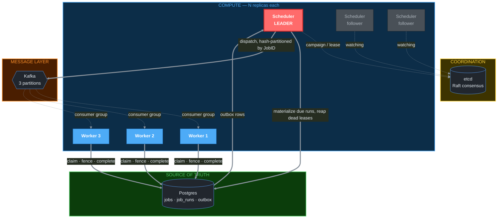
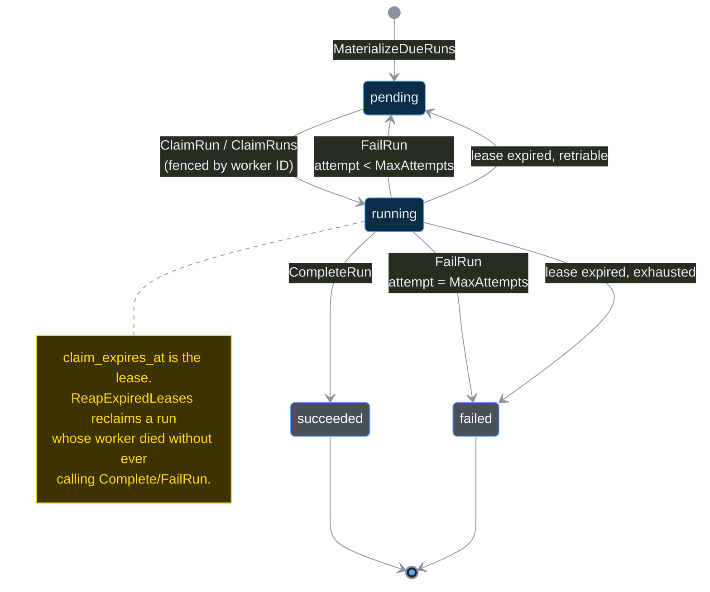
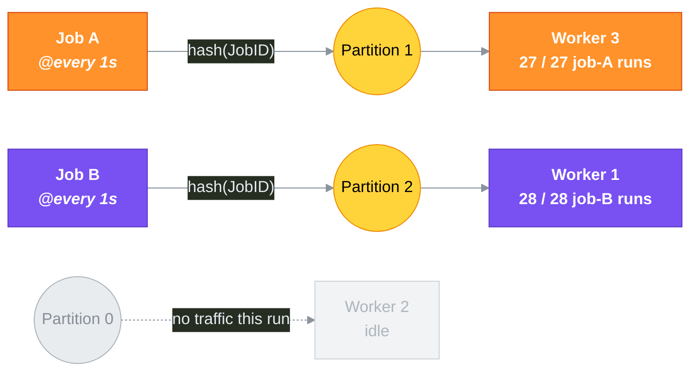
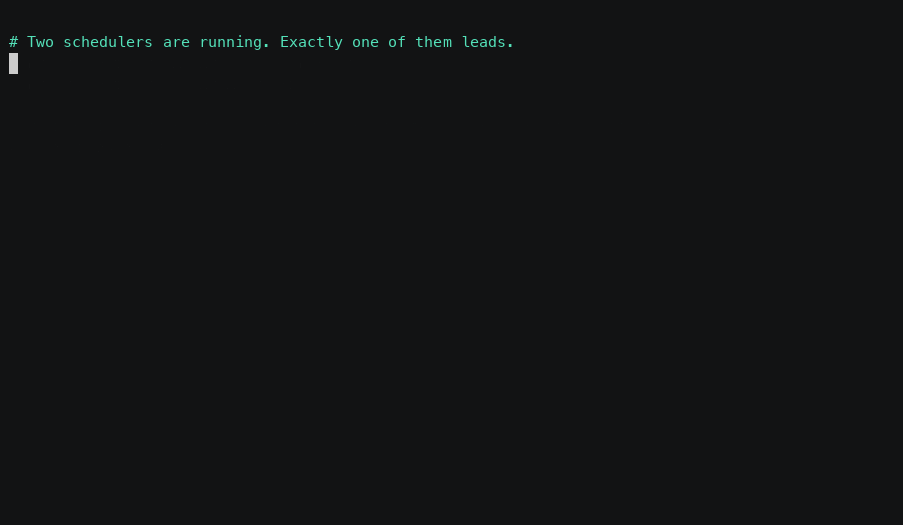

# orbit

[](https://github.com/VaibhavDangaich/Orbit/actions/workflows/ci.yml)

A distributed job scheduler — the same class of problem Kubernetes' CronJob controller, Temporal, and Airflow solve — built from scratch in Go to demonstrate the mechanics most portfolio projects wave their hands at: leader election, exactly-the-right-amount-of-execution under crashes, safe concurrent claiming with zero external coordination, and message-queue migration done correctly.

No AI, no CRUD, no web frontend. This is a systems project, and it's built to be defended in an interview, not just demoed.

## What it actually does

Define a job with a schedule (`@every 30s`) and a payload. `orbit` fires it on time, retries it if it fails, never fires it twice for the same instant, survives a crashed scheduler or a crashed worker without losing or duplicating work, spreads execution across as many workers as you run, and keeps one tenant's traffic from starving another's — all coordinated through Postgres, etcd, Kafka, and Redis, with no single point of manual intervention.

## Architecture



Only the scheduler drawn in red is actually doing anything at any given moment — the others are idle followers, watching etcd, ready to take over.

## How a job runs, end to end

```mermaid
%%{init: {'theme':'base', 'themeVariables': {
  'background': '#0d1117',
  'primaryColor': '#21262d',
  'primaryTextColor': '#e6edf3',
  'primaryBorderColor': '#58a6ff',
  'lineColor': '#8b949e',
  'textColor': '#e6edf3',
  'actorBkg': '#21262d',
  'actorBorder': '#58a6ff',
  'actorTextColor': '#e6edf3',
  'actorLineColor': '#8b949e',
  'signalColor': '#8b949e',
  'signalTextColor': '#e6edf3',
  'labelBoxBkgColor': '#21262d',
  'labelBoxBorderColor': '#58a6ff',
  'labelTextColor': '#e6edf3',
  'loopTextColor': '#e6edf3',
  'noteBkgColor': '#3d3300',
  'noteTextColor': '#ffd60a',
  'noteBorderColor': '#ffd60a',
  'activationBkgColor': '#30363d',
  'activationBorderColor': '#58a6ff',
  'sequenceNumberColor': '#0d1117'
}}}%%
sequenceDiagram
    autonumber
    participant J as jobs
    participant S as Scheduler
    participant O as outbox
    participant K as Kafka
    participant W as Worker
    participant R as job_runs

    rect rgb(13, 45, 74)
    Note over S,J: every poll_interval — only on the LEADER
    S->>J: SELECT due jobs FOR UPDATE SKIP LOCKED
    S->>R: INSERT (job_id, scheduled_for) ON CONFLICT DO NOTHING
    S->>O: INSERT outbox row
    S->>J: UPDATE next_run_at
    Note right of O: all four writes are ONE Postgres transaction
    end

    rect rgb(74, 58, 10)
    S->>O: SELECT undispatched FOR UPDATE OF o SKIP LOCKED
    S->>K: publish(run_id) — key = job_id, so it's always the same partition
    S->>O: UPDATE dispatched_at = now()
    end

    rect rgb(15, 64, 35)
    K-->>W: deliver (this worker owns the partition)
    W->>R: UPDATE status='running' WHERE status='pending'
    alt claimed successfully
        W->>W: execute(payload)
        alt succeeded
            W->>R: UPDATE status='succeeded'
        else failed, attempts remain
            W->>R: UPDATE status='pending', attempt += 1
            W->>O: INSERT outbox row — retry needs dispatching too
        else failed, attempts exhausted
            W->>R: UPDATE status='failed'
        end
    else already claimed — duplicate delivery
        Note over W: harmless no-op, thanks to fencing
    end
    W->>K: commit offset
    end
```



Blue = materialize, yellow = dispatch, green = claim-execute-report. Each zone is its own atomic step; nothing here needs a distributed transaction spanning Postgres and Kafka, because the outbox row is what makes the handoff between them safe.

## Run lifecycle



## System design concepts, and where they actually live

Every one of these is implemented and covered by a test that proves the property, not just a comment asserting it.

| Concept | Where | What it actually proves |
|---|---|---|
| **Idempotent, exactly-once-enough execution** | `migrations/0001_init.up.sql` (`UNIQUE (job_id, scheduled_for)`) | The database, not application code, refuses a duplicate firing |
| **Safe concurrent claiming, zero coordination** | `internal/store/runs.go` (`ClaimRuns`, `SELECT ... FOR UPDATE SKIP LOCKED`) | 5 concurrent goroutines race for 1 row; exactly 1 wins, proven under `-race` |
| **Fencing** | `internal/store/runs.go` (`CompleteRun`, `FailRun`) | A worker whose lease expired can't overwrite a result that isn't its to write — proven in `TestCompleteRunFencing` |
| **Misfire collapsing** | `internal/job/schedule.go` (`Schedule.FastForward`) | A scheduler down for an hour fires once on restart, not 120 times |
| **Leader election** | `internal/election` (etcd session/campaign/resign) | Only one scheduler replica does work; graceful failover is sub-second, crash failover is bounded by the election TTL — both measured live |
| **Transactional outbox** | `migrations/0002_outbox.up.sql`, `store.DispatchOutbox` | Solves the dual-write problem: a Postgres commit and a Kafka publish aren't atomic, so the outbox row is |
| **Consistent hashing** | `internal/hashring` | Adding a 6th node to a 5-node ring remaps ~16% of keys (measured), not the ~83% a naive `hash % N` would |
| **Partition-aware message routing** | `internal/queue/balancer.go` (`HashBalancer`) | A job's runs consistently land on the same Kafka partition (and, in steady state, the same worker) — verified live: 27/27 job-A firings via Kafka went to one worker, 28/28 job-B firings went to a different one, zero mixing. The single exception (1 job-A run landing on job-B's worker) came from the reconciliation sweep, which bypasses Kafka and therefore partition affinity entirely — expected, not a bug |
| **Reconciliation as a safety net, not a religion** | `cmd/worker` (`sweepLoop`) | If the outbox/Kafka path is ever down, the original batch-poll claim path still finds the work |
| **Per-tenant rate limiting without spending retries** | `internal/ratelimit` (Lua-scripted token bucket in Redis), `cmd/worker` (`handleRunID`) | An `EVAL`-atomic token bucket, checked before `ClaimRun` -- proven not to over-admit under concurrency in `TestAllowNoOverAdmitConcurrent`, the same "race for one slot" proof shape as `TestClaimRunsNoDoubleClaim`. A throttled run is deferred to `sweepLoop`, not routed through `FailRun`, so backpressure never spends one of the run's real `MaxAttempts` |
| **Metrics as a cross-cutting exception to strict containment** | `internal/metrics` | Verified live: real Prometheus scrape of both binaries via `host.docker.internal`, real Grafana query through its own provisioned datasource proxy -- `orbit_runs_claimed_total{path="sweep"}` and `orbit_runs_completed_total{status="succeeded"}` both landed on the exact count of runs actually observed executing, not just a metric that compiles |
| **Distributed tracing across an async boundary** | `internal/tracing`, `internal/queue/tracing.go` (`kafkaHeaderCarrier`) | HTTP has a standard header slot for trace context and middleware that injects/extracts it automatically; Kafka has neither. `kafkaHeaderCarrier` bridges OpenTelemetry's `propagation.TextMapCarrier` interface to `kafka.Header` slices, so a span started in `cmd/scheduler` survives sitting in a topic and resumes as the parent of a span started in a completely different `cmd/worker` process -- verified live via Jaeger's API: producer (`orbit.runs publish`) and consumer (`orbit.runs consume`) spans share one trace ID with correct parent-child linkage, and `claim_run`/`execute` spans nest correctly underneath |
| **Two independent self-healing mechanisms composing correctly** | `deploy/k8s/scheduler.yaml` (2 replicas, `PodDisruptionBudget`) | etcd's election and Kubernetes' own reconciliation loop solve *different* failure modes and don't know about each other -- verified live on a real `kind` cluster: deleting the leader pod triggered a graceful `Resign`, the etcd-elected standby took over in ~2s, and, independently, the Deployment controller replaced the deleted pod to restore replica count |
| **Real load testing surfaces real bugs** | `cmd/loadtest`, `internal/queue.NewPublisher` (`BatchTimeout`) | A load test isn't a formality: seeding 1000 jobs found kafka-go's default 1-second producer linger silently serializing every dispatch -- a one-line fix produced a ~9x throughput improvement, with before/after P50/P95/P99 numbers to show it, not just a claim that it's "fast" |
| **"Kill -9 everything" as a literal test plan, not a slogan** | `deploy/compose` (Kafka outage), any running scheduler/worker (SIGKILL) | Three real process/infra kills -- a worker mid-execution, the leader mid-burst, the message broker mid-workload -- each checked against seeded-vs-terminal-count, scoped to the test's own tenant: zero loss, every time. The worker-kill scenario goes one step further, grepping a distinct per-job token out of every worker's log to confirm `execute()` itself, not just the database row, ran exactly once |

## Proven under real failure, not just designed for it

Every diagram above is the intended design. These two are what actually happened when the design was pushed against real infrastructure.

**Leader failover — graceful vs. crash, side by side:**

```mermaid
%%{init: {'theme':'base', 'themeVariables': {
  'background': '#0d1117',
  'primaryColor': '#21262d',
  'primaryTextColor': '#e6edf3',
  'primaryBorderColor': '#58a6ff',
  'lineColor': '#8b949e',
  'textColor': '#e6edf3',
  'actorBkg': '#21262d',
  'actorBorder': '#58a6ff',
  'actorTextColor': '#e6edf3',
  'actorLineColor': '#8b949e',
  'signalColor': '#8b949e',
  'signalTextColor': '#e6edf3',
  'labelBoxBkgColor': '#21262d',
  'labelBoxBorderColor': '#58a6ff',
  'labelTextColor': '#e6edf3',
  'loopTextColor': '#e6edf3',
  'noteBkgColor': '#3d3300',
  'noteTextColor': '#ffd60a',
  'noteBorderColor': '#ffd60a',
  'activationBkgColor': '#30363d',
  'activationBorderColor': '#58a6ff',
  'sequenceNumberColor': '#0d1117'
}}}%%
sequenceDiagram
    participant A as Scheduler A
    participant E as etcd
    participant B as Scheduler B

    A->>E: Campaign()
    E-->>A: elected leader
    B->>E: Campaign() — blocks, waiting

    rect rgb(15, 64, 35)
    Note over A,B: Graceful shutdown — SIGTERM
    A->>E: Resign()
    E-->>B: elected leader
    Note over A,B: same second in the logs
    end

    rect rgb(74, 20, 20)
    Note over A,B: Crash — SIGKILL, no Resign()
    A--xE: keepalives stop
    Note over E: lease expires after ORBIT_ELECTION_TTL (3s in the demo)
    E-->>B: elected leader
    Note over A,B: ~3.7s later — measured
    end
```



A clean shutdown hands off in under a second because `Resign()` actively releases the election key. A hard crash costs the full TTL, because that's the only way etcd can tell the difference between "dead" and "just slow" — there's no free lunch, only a dial you get to choose.

**Consistent hashing, holding up under a live 2-job, 3-worker run:**



Zero mixing across dozens of firings — every job-A run went to worker 3, every job-B run went to worker 1. Worker 2 sitting idle isn't a bug: with only 2 distinct job keys spread across 3 partitions, one partition getting no traffic is exactly what you'd expect. With real job/tenant cardinality this evens out on its own.

## Load and chaos testing

**Why not k6.** k6 measures request/response latency over a network protocol. Nothing in orbit's own due-to-completed path is an HTTP request — it's a Postgres poll, an outbox dispatch, and a Kafka hop. Pointing k6 at it would mean either building `cmd/api` (a whole deferred phase, pulled in just to give a load tool something to call) or aiming it at `/metrics`, which measures nothing about the actual workload. `cmd/loadtest` is a plain Go client instead: it seeds jobs through the same `Store` every other binary uses, waits for them to reach a terminal run, and reads the results back the same way.

```bash
go run ./cmd/loadtest   # ORBIT_LOADTEST_JOBS (default 1000), ORBIT_LOADTEST_TENANTS (default 20)
```

Latency is reported as three real segments, not one end-to-end blob, using columns every run already has:

| Segment | Formula | What dominates it |
|---|---|---|
| Scheduler lag | `created_at - scheduled_for` | `ORBIT_POLL_INTERVAL` / `ORBIT_BATCH_SIZE` — the materialize ceiling is `batch_size / poll_interval` runs/sec, by construction |
| Dispatch + delivery | `started_at - created_at` | Outbox tick + Kafka publish/consume |
| Execution | `finished_at - started_at` | `execute()` itself |

Jobs are spread across many tenants (`ORBIT_LOADTEST_TENANTS`), not one — seeding a single-tenant burst would measure `internal/ratelimit`'s per-tenant cap (10/s by default), not the pipeline's real throughput. A single-tenant burst is its own, different, useful measurement (see "known gap" below), not this one's default.

**A real bug, found by running it, not by inspection.** The first run (1000 jobs, poll_interval=5s, batch_size=50 → a documented ceiling of 10 runs/sec) materialized only 200 jobs in 3 minutes — nowhere near the ~1800 the ceiling predicts. Cause: `internal/queue.Publisher`'s `kafka.Writer` never set `BatchTimeout`, so it used kafka-go's default of a full second. `store.DispatchOutbox` calls `Publish` once per row in a sequential loop, each call blocking on that second of pure linger with nothing else to batch with — every dispatched run was paying ~1s of avoidable delay, serialized. Fixed with one line (`BatchTimeout: 10 * time.Millisecond`) and re-run:

| Segment | Before fix (p50 / p99) | After fix (p50 / p99) |
|---|---|---|
| Scheduler lag | 1m40.8s / 2m31.0s | 51.5s / 1m36.5s |
| Dispatch + delivery | 16.1s / 40.4s | 341ms / 636ms |
| Execution | 11ms / 28ms | 1ms / 4ms |
| End-to-end | 1m41.8s / 2m51.2s | 51.6s / 1m37.0s |
| Jobs completed in 3 min | 200 / 1000 | 1000 / 1000 |

After the fix, the "before" 3-minute timeout (200/1000) became a 97-second full completion (1000/1000) — the scheduler-lag numbers now track the stated `batch_size`/`poll_interval` ceiling almost exactly, which is what a defensible P99 looks like: reproducible from the config, not a number pulled out of a run.

**Known gap, stated plainly**: found but not chased further — seeding all jobs under one tenant (a single-tenant burst) makes a run's execution time exceed `ORBIT_LEASE` (30s default) trigger real, repeated reap-and-retry cycles even with zero worker crashes, since `ReapExpiredLeases` can't distinguish "abandoned" from "still running, just slow." Worth knowing before setting `ORBIT_LEASE` shorter than your slowest expected job.

### Chaos: kill -9 everything, prove no loss

Three scenarios, each with the invariant decided before running anything: seeded count vs. terminal `job_runs` count, scoped to the test's own tenant so shared-infra noise can't contaminate the result.

**1. SIGKILL a worker mid-execution.** Seeded jobs with an 8-second payload; too short — the worker had already called `CompleteRun` before the kill landed, since I was watching for `status='running'` and killing by hand. Re-run with a 15-second payload (safely under the 30s lease) closed that race: `kill -9` the worker holding the lease, watch `ReapExpiredLeases` reclaim it (`pending`, `attempt=2`) once the lease genuinely expired, watch a *different*, surviving worker claim and complete it.

A single terminal `status` row is bookkeeping, not proof `execute()` itself only ran once -- a killed worker that got most of the way through and a second worker that finished it cleanly would look identical in the database. To check the thing itself, not just its bookkeeping: seeded each job's payload with a distinct message (`execute()` already logs `executed: <message>`), then grepped every worker's log for the killed run's specific token. **Result: exactly one `executed: verify-token-1` line across all logs, from the surviving worker that completed it on attempt 2 -- zero from the killed one, whose process died mid-`sleep()`, before it ever reached the log line.** Real evidence of exactly-once execution, not an inference from a single status column.

**2. SIGKILL the leader scheduler mid-burst.** Seeded 200 jobs, killed the leader (`kill -9`, no `Resign()` — the crash path, not the graceful one already shown above) after only 100 of 200 had materialized. Standby elected leader in ~6-7s, bounded by `ORBIT_ELECTION_TTL` (10s) since there was no graceful handoff to speed it up. The new leader resumed materializing the other 100 without being told to. **Result: 200/200 succeeded, 0 failed, zero jobs lost across the gap** — this is the actual scenario the outbox pattern and the fenced `pending`-state design exist for, and "killed it mid-burst and lost nothing" is the sentence that proves it, not a description of the mechanism.

**3. Stop Kafka entirely, mid-workload.** Seeded 30 jobs, then `docker stop`'d the Kafka container. Scheduler logged repeated `dial tcp ...: connection refused` on every dispatch attempt and kept ticking; worker logged the same on every consume attempt and kept running — neither crashed. `sweepLoop`'s periodic Postgres-only `SKIP LOCKED` scan, which never touches Kafka, claimed and executed all 30 anyway. **Result: 30/30 succeeded with the message broker completely down for the whole run** — checked via `job_runs` state, not by grepping for a "sweep claimed" log line, since that line only prints when a sweep pass actually finds something and its *absence* proves nothing either way.

## Getting started

### Run the whole system — Docker only, no Go toolchain

```bash
# Infrastructure, schema migrations, 2 schedulers and 3 workers, in one command
docker compose -f deploy/compose/docker-compose.yml --profile app up -d --build \
  --scale scheduler=2 --scale worker=3

# Seed a job (there's no API yet -- see Roadmap)
docker exec -i compose-postgres-1 psql -U scheduler -d scheduler -c \
  "INSERT INTO jobs (tenant_id, name, schedule, payload, enabled, max_attempts, next_run_at) \
   VALUES ('demo', 'hello', '@every 10s', '{\"message\":\"hello from orbit\"}', true, 3, now());"

# Watch it work
docker compose -f deploy/compose/docker-compose.yml logs -f scheduler worker
```

`scheduler=2` is the interesting part: both containers start, exactly one wins the etcd election, and the other waits as a hot standby. `docker kill` the leader and the standby takes over — see [Watch it fail over](#watch-it-fail-over) below.

Schema creation is not a step here. A `migrate` service (golang-migrate) applies `migrations/*.up.sql` before the app starts and records the applied version, so it re-runs safely on every boot. It runs on a plain `up -d` too, since the host workflow below and the test suite need those tables just as much.

> Upgrading a database created before that service existed? It has tables but no `schema_migrations` row, so baseline it once — the exact command is commented in `deploy/compose/docker-compose.yml` above the `migrate` service. It writes only the version marker and touches no data.

### Develop on it — Go 1.26+

The app services sit behind a `--profile app` gate, so a bare `up -d` starts infrastructure and migrations only, leaving the binaries to you:

```bash
docker compose -f deploy/compose/docker-compose.yml up -d

go run ./cmd/scheduler
go run ./cmd/worker
```

Run a second `go run ./cmd/worker` in another terminal and watch work split across both. Run a second `go run ./cmd/scheduler` and only one will log "elected leader" — kill it and watch the other take over.

Don't mix the two: an `app`-profile scheduler and a `go run` scheduler will both join the same election, which is legal but makes it much harder to tell which process you're actually watching.

## Watch it fail over



Both halves of that recording are real, unedited and reproducible — `demo/failover-demo.sh` is the script it runs.

The single most load-bearing claim in this README is that killing the active scheduler doesn't stop jobs from firing. Here's how to make that happen on your own machine in about a minute — and, more usefully, how to see that **the two ways of killing it behave differently**, which is where the interesting engineering actually is.

Start two schedulers and find the leader:

```bash
docker compose -f deploy/compose/docker-compose.yml --profile app up -d --build \
  --scale scheduler=2 --scale worker=3

docker compose -f deploy/compose/docker-compose.yml logs scheduler | grep -E "campaigning|elected leader"
```

Exactly one container logs `elected leader`. The other stays on `campaigning for leadership` — a hot standby, already connected to etcd, Postgres and Kafka, blocked inside `Campaign` waiting for the key to free up.

**Graceful — `docker stop` (SIGTERM):**

```bash
docker stop compose-scheduler-1   # whichever one logged "elected leader"
```

The process catches SIGTERM, stops its tick loop, and calls `Resign()` before exiting. Resigning deletes the election key immediately, so the standby's blocked `Campaign` returns **in milliseconds**. You will struggle to catch a gap.

**Crash — `docker kill` (SIGKILL):**

```bash
docker kill compose-scheduler-1
```

SIGKILL cannot be caught, so nothing resigns. The election key survives, still held by a process that no longer exists, until its etcd lease expires — which takes up to `ORBIT_ELECTION_TTL` (10s by default). Only then does the standby get promoted.

That gap is not a bug to be tuned away; it's the price of detecting a death nobody announced, and it's the same trade every lease-based system makes. Lower the TTL and failover is faster but a brief etcd hiccup can evict a healthy leader; raise it and you survive network blips at the cost of a longer silent window.

| | signal | resign? | time to next leader | measured |
|---|---|---|---|---|
| `docker stop` | SIGTERM | yes, explicit `Resign()` | bounded by an etcd round-trip | **290 µs** |
| `docker kill` | SIGKILL | no — process is simply gone | up to `ORBIT_ELECTION_TTL` (10s) | **8.6 s** |

Those are from one sitting on a laptop, not a benchmark — but the ~30,000× gap between them is the entire point, and it comes from the design rather than the hardware. The exact log lines behind the recording above:

```
# CRASH — no resign, so the standby waits out a lease nobody released
$ docker kill compose-scheduler-1                        # killed at 23:38:42
scheduler-2  2026-09-17T23:38:50.582107465Z  elected leader
                                  └─ 8.6s after the kill

# GRACEFUL — Resign() deletes the key, and the standby is already blocked on it
$ docker stop compose-scheduler-2
scheduler-2  2026-09-17T23:39:01.959640429Z  resigned leadership
scheduler-1  2026-09-17T23:39:01.959930220Z  elected leader
                                  └─ 290µs after the resign
```

Through both events, the workers logged 22 executions of a 5-second job without a gap.

The crash number is the one that tells you something. It isn't latency that better code would remove: nobody told etcd the leader died, so the only way to find out is to wait for a lease nobody is renewing. Every lease-based system pays this, and the TTL is the dial — shorter means faster failover and a higher chance a brief etcd hiccup evicts a leader that was perfectly healthy.

Neither container comes back on its own, and that surprised me enough to be worth writing down. Both services declare `restart: unless-stopped`, but Docker suppresses the restart policy for any container an operator stopped or killed by hand — `docker inspect` after a `docker kill` reports `RestartPolicy=unless-stopped`, `Status=exited`, `RestartCount=0`. The policy fires when the process dies on its own, not when you kill it from outside. So bring the old leader back yourself, and it rejoins as the standby:

```bash
docker start compose-scheduler-1
```

Worth knowing before you design a chaos test around it: "I killed the container and it healed" is not something `restart: unless-stopped` will give you, and on a distroless image there's no shell to `docker exec ... kill 1` with either.

Jobs keep firing across both cases. Nothing is lost in the crash case either: `next_run_at` lives in Postgres, not in the dead scheduler's memory, so the incoming leader materialises whatever came due during the gap on its first tick.

## Terminal dashboard

```bash
go run ./cmd/tui
```

A single-screen, read-only view of live scheduler state — the `k9s`/`lazydocker`-style alternative to querying Postgres by hand while watching a demo run. It polls `internal/store` every 2s (`tea.Tick`, no manual refresh) and shows:

- **Jobs** — id, tenant, name, schedule, enabled, and next run time (rendered relative to now, e.g. `in 5s` / `12s ago` — an overdue job is a sign the scheduler is falling behind).
- **Run status counts** — pending/running/succeeded/failed, scoped to the most recent 500 runs by ID (`internal/store/dashboard.go`'s `RunStatusCounts`), not a time window — see that file's doc comment for why: an `ORDER BY id DESC LIMIT n` scan costs the same whether `job_runs` has a thousand rows or a hundred million, where a `created_at`-based window would have to scan every older row to rule it out.

`q` or `ctrl+c` quits. Like the other two binaries, it's configured entirely by `ORBIT_*` environment variables (`ORBIT_DATABASE_URL`, defaulting to `store.DefaultDevDSN` like everything else) — no flags, no config file, and it never writes to the database: no job creation or run cancellation from here, on purpose, the same "don't build it before there's a real need" restraint behind deferring a pluggable executor.

## Observability

`cmd/scheduler` and `cmd/worker` each expose a Prometheus `/metrics` endpoint (`internal/metrics`, the only package that imports `prometheus/client_golang` — same containment principle as store/election/queue/ratelimit for their infra dependencies). `deploy/compose` runs Prometheus and Grafana, with Prometheus auto-provisioned as Grafana's datasource — no manual "add data source" click-through.

Prometheus scrapes both binaries wherever they happen to be running: host processes via `host.docker.internal`, and `--profile app` containers via Docker's DNS, which returns one A record per replica. That second path uses `dns_sd_configs` rather than a static target so that `--scale worker=3` is picked up without naming replicas in the scrape config. Both sets of jobs are configured permanently and whichever isn't running simply reports no targets.

```bash
open http://localhost:9090   # Prometheus — raw queries, scrape target health
open http://localhost:3001   # Grafana — Prometheus pre-wired as the default datasource
```

| Metric | Type | What it proves |
|---|---|---|
| `orbit_runs_materialized_total` | counter | Runs actually created by `MaterializeDueRuns` |
| `orbit_schedule_misfires_total` | counter | Missed occurrences `FastForward` collapsed away — how far behind the scheduler has fallen |
| `orbit_runs_dispatched_total` | counter | Successful Kafka publishes via the outbox |
| `orbit_runs_claimed_total{path}` | counter | Claims by path (`kafka` vs `sweep`) — a live number for "reconciliation as a safety net," not just a claim in prose |
| `orbit_runs_completed_total{status}` | counter | Outcomes by result (`succeeded` / `retried` / `failed`) |
| `orbit_runs_rate_limited_total` | counter | Runs deferred because their tenant was over budget |
| `orbit_leader_status` | gauge | 1 on whichever scheduler replica currently holds leadership, 0 elsewhere — scrape multiple replicas on distinct ports and a failover becomes visible as one line dropping while another rises |
| `orbit_run_execution_duration_seconds` | histogram | Time spent in `execute()` — the raw material for the P50/P95/P99 numbers on the roadmap |

**Verified live, not just wired up**: ran the real scheduler + worker against real Prometheus and Grafana, and every one of the numbers above came back correct and internally consistent — `orbit_runs_materialized_total` and `orbit_runs_dispatched_total` matched exactly, `orbit_runs_claimed_total{path="sweep"}` and `orbit_runs_completed_total{status="succeeded"}` both landed on the same count as the runs actually observed executing in the logs, and `orbit_run_execution_duration_seconds_count` was nonzero on the worker and correctly zero on the scheduler (execution only happens in one of them). That specific run happened to be claimed entirely by the reconciliation sweep rather than the Kafka path (a Kafka consumer-group join took longer than the sweep's next tick) — not a failure, exactly the scenario the sweep exists for, and now it's a real number instead of just a design claim. Queried Prometheus directly and through Grafana's own datasource proxy to confirm both paths return identical live data.

### Tracing

`internal/tracing` installs an OpenTelemetry `TracerProvider` in both binaries at startup, exporting to Jaeger over OTLP/gRPC (`deploy/compose` runs `jaegertracing/all-in-one`, which accepts OTLP natively). `cmd/scheduler` starts a **producer** span in `internal/queue.Publisher.Publish` and injects it into the Kafka message's headers; `cmd/worker` extracts it back out in `Consumer.Next`, starting a **consumer** span as its child, with `claim_run` and `execute` spans nested one level deeper. HTTP has a standard header slot and middleware for this; Kafka has neither, so `internal/queue/tracing.go`'s `kafkaHeaderCarrier` is the actual mechanism that lets a span survive sitting in a topic and resume in a different process.

```bash
open http://localhost:16686   # Jaeger UI — search by service (orbit-scheduler / orbit-worker) or trace ID
```

**Verified live, not just wired up**: ran the real scheduler + worker, seeded a job, and queried Jaeger's HTTP API directly for the resulting trace. `orbit.runs publish` (service `orbit-scheduler`, root span) and `orbit.runs consume` (service `orbit-worker`) shared one trace ID with a correct `CHILD_OF` reference, and `orbit.worker claim_run` / `orbit.worker execute` nested correctly underneath the consumer span — a real cross-process, cross-Kafka-boundary trace, not two spans that merely look related. One honest gap found in the process: this project's shared dev Kafka topic (`orbit.runs`) has accumulated backlog across many months of manual testing (topics are durable; nothing here purges them), and a couple of those old messages happened to reuse a run ID from the fresh test run after an unrelated Postgres reset earlier in development — those pre-tracing messages correctly show up in Jaeger as standalone root spans (no crash, no corruption, just no parent to link to, exactly as W3C Trace Context propagation should behave for a message with no `traceparent` header). Not a tracing bug; a reminder that a long-lived dev topic needs occasional cleanup, same lesson `internal/queue`'s own tests already learned (see `queue_test.go`'s per-test disposable topic).

### Configuration

All three binaries are configured entirely by environment variables (no config file, no flags) — the standard pattern for anything meant to run in a container.

The defaults below are the **host-process** values, which is what you get from `go run`. Anything running inside a container needs different ones, because the defaults name host-mapped ports that only exist on the host:

| where it runs | Postgres | Kafka | Redis |
|---|---|---|---|
| host (`go run`, tests, TUI) | `localhost:5433` | `localhost:19092` | `localhost:6380` |
| compose (`--profile app`) | `postgres:5432` | `kafka:9095` | `redis:6379` |
| kind pods (`deploy/k8s`) | `host.docker.internal:5433` | `host.docker.internal:19094` | `host.docker.internal:6380` |

The Kafka column is the one that bites. `kafka:9092` looks like the obvious compose value and it is wrong — the connection succeeds and then topic creation fails, because the broker answers the controller lookup with the `PLAINTEXT` listener's advertised address (`localhost:19092`), which inside a container means that container. Each row uses a listener advertising an address resolvable from that particular "where"; see the `kafka` service comments in `deploy/compose/docker-compose.yml`.

**`cmd/scheduler`**

| Variable | Default | Meaning |
|---|---|---|
| `ORBIT_NODE_ID` | `<hostname>-<pid>` | Identity used in leader election |
| `ORBIT_DATABASE_URL` | local dev Postgres | Postgres connection string |
| `ORBIT_POLL_INTERVAL` | `5s` | How often the leader ticks (materialize, reap, dispatch) |
| `ORBIT_BATCH_SIZE` | `50` | Max rows processed per tick |
| `ORBIT_ETCD_ENDPOINTS` | `localhost:2379` | Comma-separated etcd endpoints |
| `ORBIT_ELECTION_KEY` | `/orbit/scheduler-leader/` | etcd key the leader election runs on |
| `ORBIT_ELECTION_TTL` | `10s` | Leader session TTL — the failover-speed/flapping-sensitivity tradeoff |
| `ORBIT_KAFKA_BROKERS` | `localhost:19092` | Comma-separated Kafka brokers |
| `ORBIT_KAFKA_PARTITIONS` | `3` | Partition count for topic creation |
| `ORBIT_METRICS_ADDR` | `:9101` | Address the Prometheus `/metrics` endpoint binds to |
| `ORBIT_OTLP_ENDPOINT` | `localhost:4317` | Jaeger's OTLP/gRPC receiver address |

**`cmd/worker`**

| Variable | Default | Meaning |
|---|---|---|
| `ORBIT_WORKER_ID` | `<hostname>-<pid>` | Identity used for lease claims |
| `ORBIT_DATABASE_URL` | local dev Postgres | Postgres connection string |
| `ORBIT_LEASE` | `30s` | How long a claimed run is held before it's considered abandoned |
| `ORBIT_SWEEP_INTERVAL` | `30s` | How often the reconciliation sweep runs |
| `ORBIT_BATCH_SIZE` | `10` | Max rows the sweep claims per pass |
| `ORBIT_KAFKA_BROKERS` | `localhost:19092` | Comma-separated Kafka brokers |
| `ORBIT_KAFKA_GROUP` | `orbit-workers` | Consumer group — all workers should share this |
| `ORBIT_REDIS_ADDR` | `localhost:6380` | Redis address backing the per-tenant rate limiter |
| `ORBIT_RATE_LIMIT_PER_TENANT` | `10` | Token bucket capacity and refill rate, in requests/sec, applied uniformly to every tenant |
| `ORBIT_METRICS_ADDR` | `:9102` | Address the Prometheus `/metrics` endpoint binds to -- different default from `cmd/scheduler` so running one of each locally doesn't collide |
| `ORBIT_OTLP_ENDPOINT` | `localhost:4317` | Jaeger's OTLP/gRPC receiver address |

**`cmd/tui`**

| Variable | Default | Meaning |
|---|---|---|
| `ORBIT_DATABASE_URL` | local dev Postgres | Postgres connection string |
| `ORBIT_TUI_REFRESH_INTERVAL` | `2s` | How often the dashboard polls the store |
| `ORBIT_TUI_JOB_LIMIT` | `50` | Max jobs shown in the table |
| `ORBIT_TUI_RUN_WINDOW` | `500` | How many of the most recent runs the status counts are scoped to |

## Kubernetes

`deploy/k8s` has real Deployment/Service/ConfigMap/Secret/PodDisruptionBudget/HorizontalPodAutoscaler manifests for `cmd/scheduler` and `cmd/worker` — not a re-packaging of `deploy/compose`'s infra as YAML. Postgres/etcd/Kafka/Redis/Jaeger stay where `deploy/compose` already runs them; in a real deployment those would be managed services (RDS, MSK, ElastiCache) or installed from the Helm charts their own maintainers publish, not hand-rolled StatefulSets duplicating what a real team wouldn't build either. `deploy/docker/{scheduler,worker}.Dockerfile` are multi-stage builds onto `gcr.io/distroless/static-debian12` — no shell, no package manager, nothing for a CVE scanner to flag but the binary's own dependencies.

```bash
kind create cluster --name orbit
docker build -f deploy/docker/scheduler.Dockerfile -t orbit-scheduler:dev .
docker build -f deploy/docker/worker.Dockerfile -t orbit-worker:dev .
kind load docker-image orbit-scheduler:dev orbit-worker:dev --name orbit
kubectl apply -k deploy/k8s
```

The scheduler runs 2 replicas on purpose — this is the actual point of putting it under a ReplicaSet. `internal/election`'s etcd campaign, not Kubernetes, decides which one does any work; the other sits as a warm standby, already past its own startup+campaign path, ready to take over the instant the leader's session lapses. A `PodDisruptionBudget` (`minAvailable: 1`) keeps a voluntary disruption (a node drain, a cluster upgrade) from evicting both at once. The worker runs behind a CPU-based `HorizontalPodAutoscaler` — an honest, available signal, not the queue-depth-based one that would actually justify scaling (that needs a `custom.metrics.k8s.io` adapter reading Kafka consumer lag from Prometheus, e.g. KEDA's Kafka scaler — real infrastructure this project doesn't run yet, named here rather than faked).

**Verified live, not just applied and assumed correct**: ran both Deployments on a real local `kind` cluster, seeded a job, and watched it materialize → dispatch → consume → execute end to end from inside the cluster. Found and fixed a real bug in the process: Kafka's `KAFKA_ADVERTISED_LISTENERS` was hardcoded to `localhost:19092`, which only ever worked because the scheduler used to run as a host process — inside a pod, "localhost" resolves to the pod itself, not the host machine. Fixed by giving Kafka a second listener (`K8S`, advertised as `host.docker.internal:19094`) specifically for in-cluster clients, the standard multi-listener pattern real Kafka deployments use for internal-vs-external traffic — see `deploy/compose/docker-compose.yml`'s `kafka` service comment. Also proved failover works the same way it did in the original etcd-only demo, now under Kubernetes: deleted the leader pod (`kubectl delete pod`, which sends a graceful `SIGTERM` first) and the standby was elected leader within ~2 seconds via `Resign`, while the Deployment controller independently replaced the deleted pod to restore the replica count — two different self-healing mechanisms (etcd's election, Kubernetes' reconciliation loop) proven to compose correctly rather than assumed to.

**Known gap, stated plainly**: liveness/readiness probes reuse the existing `/metrics` endpoint (a valid "is the HTTP server alive" signal) rather than a dedicated `/healthz` that checks Postgres/etcd/Kafka reachability — a pod can report itself "ready" while unable to reach any of its actual dependencies. A real health-check endpoint distinguishing liveness from dependency-readiness is the natural next step, not built here because the existing endpoint was enough to prove the deployment topology itself works.

## Project structure

```
cmd/
  scheduler/     leader-elected loop: materialize due runs, reap dead leases, dispatch to Kafka
  worker/        claims + executes runs, via Kafka (primary) and a periodic sweep (safety net)
  tui/           bubbletea dashboard: read-only, live job/run-status view (internal/store/dashboard.go)
  loadtest/      seeds a burst of jobs, waits for completion, reports P50/P95/P99 latency by segment
internal/
  job/           pure domain logic (Schedule, Job, Run) -- no database, no infra, fully unit-tested
  store/         the only package that knows Postgres exists
  election/      the only package that knows etcd exists
  queue/         the only package that knows Kafka exists
  hashring/      consistent hashing, standalone and fully tested on its own
  ratelimit/     the only package that knows Redis exists
  metrics/       the only package that knows Prometheus's client library exists
  tracing/       the only package that knows the OpenTelemetry SDK exists
migrations/      versioned SQL, golang-migrate-compatible naming
deploy/compose/  local dev infrastructure (Postgres, etcd, Kafka, Redis, Prometheus, Grafana, Jaeger)
deploy/docker/   multi-stage Dockerfiles for cmd/scheduler and cmd/worker
deploy/k8s/      Deployment/Service/ConfigMap/Secret/PDB/HPA manifests for cmd/scheduler and cmd/worker
```

Every `internal/` package is a hard boundary, not a convention: the Go compiler itself blocks any package outside this module from importing it. Each infra dependency (Postgres, etcd, Kafka, Redis, Prometheus) is contained to exactly one package that owns it; nothing else in the codebase imports a driver directly. `internal/metrics` is the one deliberate exception to "one package calls into another via a narrow interface, never a direct import" -- see its doc comment for why a metrics client is a different kind of dependency than a stateful connection pool.

## Design decisions worth knowing before an interview asks about them

- **`SKIP LOCKED` isn't what prevents duplicate runs.** The `UNIQUE (job_id, scheduled_for)` constraint does that, on its own, even with zero other locking. What `SKIP LOCKED` prevents is a subtler bug: two schedulers racing to advance the same job's `next_run_at` and one silently undoing the other's progress.
- **Leader election is about efficiency, not safety.** The system is already correct with multiple scheduler replicas running unelected — `SKIP LOCKED` alone prevents duplicate work. Election exists so N replicas don't all redundantly hammer Postgres with the same query every tick, and so there's one unambiguous owner instead of a free-for-all.
- **"Exactly once" is never claimed anywhere in this codebase.** The real guarantee is at-least-once delivery with idempotent, fenced execution — which composes to "effectively once" in practice. Claiming true exactly-once is the kind of overstatement a good interviewer will immediately probe.
- **The outbox pattern exists because a DB commit and a Kafka publish aren't atomic.** Publishing inside the transaction risks a phantom message for a row that gets rolled back; publishing after commit risks a crash silently losing the dispatch. The outbox row, written atomically with the state change, is what closes that gap — at the cost of being only ever "at least once," which is exactly why the fencing above has to exist regardless of whether Kafka is involved.
- **Consistent hashing and Kafka consumer groups solve different problems.** Kafka's group coordinator already rebalances partitions across live workers on its own. The hash ring's job is narrower: giving a job's runs a *stable* partition over time (and minimal disruption if the topic is ever repartitioned) — not replacing worker-level load balancing, which Kafka already does.

## Known limitations

Stated explicitly rather than glossed over:

- **No API yet** — jobs are inserted directly via SQL. A `cmd/api` service is the natural next step.
- **`cmd/worker` has a per-run N+1 query** (`GetJob` after every claim, to fetch the payload) — fine at current batch sizes, a known candidate for folding into the claim query itself if it ever becomes a hot path.
- **No pluggable executor** — `cmd/worker/execute.go` is a single function, not an `Executor` interface with a registry, because there's exactly one kind of job so far. Building the abstraction before a second kind exists would be solving a problem this system doesn't have yet.
- **Rate limiting is global-shape, not per-tenant configurable** — `ORBIT_RATE_LIMIT_PER_TENANT` sets one requests/sec ceiling applied uniformly to every tenant's own bucket. A database-backed, per-tenant-configurable limit is the natural next step once real tenant traffic makes that a genuine need, not before.
- **A rate-limited run waits for the sweep, not instant redelivery** — `cmd/worker` never routes a throttled run through `FailRun` (that would spend a real retry attempt on pure backpressure), so it stays `pending` and is only retried on `sweepLoop`'s interval (default 30s). A severely throttled tenant's jobs are slower to drain than a healthy tenant's, on purpose — stated here rather than left as a surprise.
- **`sweepLoop` doesn't enforce the rate limit at all** — `ClaimRuns`' batch scan claims up to `ORBIT_BATCH_SIZE` pending runs regardless of tenant, with no call into `internal/ratelimit`. This is intentional (the sweep is what *drains* a throttled tenant's backlog; gating it too would mean a severely throttled tenant never makes progress at all) but it does mean a tenant sitting in the sweep's batch briefly runs unmetered — worth knowing before assuming the limit holds everywhere, all the time.
- **The rate limiter fails open if Redis is unreachable** — `cmd/worker` logs it loudly and lets the run proceed as if allowed, rather than treating a Redis outage as "reject everything." The reasoning (favoring availability of the Kafka fast path over strict enforcement) is in `handleRunID`'s comment; the tradeoff is that a Redis outage means tenants are temporarily unlimited, not temporarily blocked.
- **`cmd/tui` shows jobs and run counts, not who the current leader is or which worker ran what** — `internal/election` doesn't expose a read-only "who's leader" query yet, and `job_runs.claimed_by` isn't surfaced in the dashboard. Both are natural additions to `internal/store/dashboard.go`/`internal/election`, deferred because the jobs + run-status view alone already proves live visibility; adding them speculatively before there's a demo that needs them would be the same mistake this project has already avoided elsewhere.
- **The dev Kafka topic (`orbit.runs`) is durable and never purged** — months of manual local testing leave backlog behind, and after a Postgres reset that backlog can reference run IDs that no longer exist (harmless: `GetRunTenant` returns `not found` and the message is skipped). This is exactly why `internal/queue`'s own tests give themselves a disposable per-test topic instead of using the shared one — the production code intentionally doesn't do this (the topic is meant to be long-lived), so periodic manual cleanup (`docker compose down -v` or deleting/recreating the topic) is the accepted tradeoff for a local dev environment, not something worth automating for a single-node demo.
- **`ORBIT_LEASE` must exceed your slowest job, or the reaper fights healthy work** — found during chaos testing: a job whose `execute()` genuinely takes longer than the 30s default lease gets treated as abandoned and retried, over and over, even with zero actual worker crashes, because `ReapExpiredLeases` has no way to distinguish "abandoned" from "still running, just slow." Not a bug to fix (the lease has to expire on *some* timeout) — a configuration relationship worth stating rather than discovering by surprise.

## Roadmap

- [x] Redis-backed per-tenant rate limiting
- [x] Prometheus metrics + Grafana (see "Observability" below)
- [x] OpenTelemetry distributed tracing across the scheduler → Kafka → worker boundary (see "Observability")
- [x] Kubernetes deployment manifests (see "Kubernetes")
- [x] Load testing with published P50/P95/P99 numbers, plus chaos testing (kill -9 everything, prove no loss) — see "Load and chaos testing"
- [x] A terminal dashboard (`bubbletea`) for live job/run/leader/worker visibility

## Testing

```bash
go test ./... -race
```

Every package with infrastructure dependencies (`internal/store`, `internal/queue`, `internal/ratelimit`) skips cleanly with a clear message if Postgres/Kafka/Redis isn't running, rather than failing opaquely. `internal/job` and `internal/hashring` are pure logic and need nothing running at all.

That skip-don't-fail behaviour is convenient locally and dangerous in CI: a pipeline without those services would report green while testing almost nothing. So [`.github/workflows/ci.yml`](.github/workflows/ci.yml) runs Postgres, Redis and Kafka as real service containers, on the same host ports `deploy/compose` uses — which lets `store.DefaultDevDSN`, `ratelimit.DefaultDevAddr` and `queue.DefaultDevBrokers` resolve unmodified, so a drifting default breaks the build instead of quietly skipping past it. A preflight step dials all three ports before `go test` runs, turning "the services never came up" from an invisible skip into a failed job. Tests run under `-race`, and both container images are built in a parallel job.

Nothing is mocked in CI. The same fencing, election and partition-assignment code paths that back the claims above run against real Postgres, real Kafka and real Redis on every push.

Correctness claims in this README aren't just asserted — the ones involving real concurrency or real infrastructure (fencing, leader failover, partition stickiness, zero-duplication under retries, rate limiting without spending retries) were verified against live Postgres, etcd, Kafka, and Redis, not just unit-tested in isolation.
